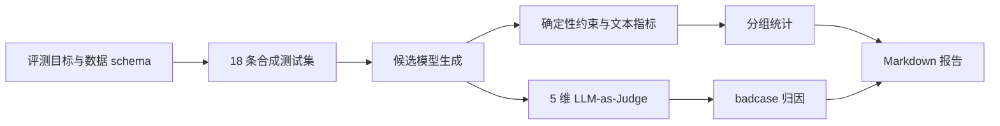

# XHS Copy Eval

一个可复现的中文生活方式文案端到端评测项目：自建 18 条小型评测集，并加入 200 条
可追溯的真实商品列表快照，完成模型生成、
自动指标、LLM-as-Judge、badcase 归因和 Markdown 报告，并提供
`lm-evaluation-harness` 自定义 task。

> 项目与小红书平台无隶属或合作关系，不抓取小红书用户内容。真实商品库只保存公开商家列表
> 页的短文本元数据与来源链接；卖家主张不等于项目方已验证事实。

[查看离线演示报告](reports/demo_report.md) ·
[一页评测方法论](docs/methodology.md) ·
[5 分钟面试自述](docs/interview_story.md) ·
[标准任务 smoke 记录](docs/benchmark_runs.md) ·
[评测集说明](data/DATASET_CARD.md) ·
[商品库说明](data/products/CATALOG_CARD.md)

## 为什么这个项目值得展示

- **能复现**：不配置 API Key 也能运行 18 条完整流水线；固定 replay fixtures 便于 CI 回归。
- **不唯自动指标**：ROUGE-L / Char-BLEU 只做表面信号，主结论来自 5 维 Rubric。
- **可审计**：每条 Judge 结果保留分数、理由、证据和解析错误，失败自动归因。
- **可换模型**：同一套接口可接 DeepSeek、通义、智谱、OpenAI 或本地 vLLM。
- **有工程规范**：Pydantic schema、CLI、YAML 配置、原子写入、日志、单测与 GitHub Actions。

## 30 秒运行

需要 Python 3.10–3.13 和 [uv](https://docs.astral.sh/uv/)：

```bash
git clone https://github.com/zhangmaojn/xhs-copy-eval.git
cd xhs-copy-eval
uv sync --extra dev
uv run xhs-eval validate --dataset data/xhs_eval.jsonl
uv run xhs-eval catalog-validate \
  --catalog data/products/alibaba_products_20260908.jsonl
uv run xhs-eval run --config configs/demo.yaml
```

输出：

```text
artifacts/demo_predictions.jsonl   # 模型输出
artifacts/demo_metrics.json        # 自动指标与逐条约束检查
artifacts/demo_judgements.jsonl    # Judge 分数、证据与归因
reports/demo_report.md             # 面试可展示的完整报告
```

## 端到端流程



评测集覆盖美妆护肤、美食生活、旅行城市、家居收纳、运动健身、职场成长 6 类内容；
每类包含 easy / medium / hard，重点测试指令遵循、事实边界、平台风格、信息价值与安全合规。

## 使用真实 API 模型

复制示例配置并设置环境变量。密钥只从环境变量读取，不会写入产物：

```bash
cp configs/openai_compatible.example.yaml configs/local-api.yaml
export LLM_API_KEY="..."
export LLM_BASE_URL="https://api.deepseek.com/v1"
export LLM_MODEL="deepseek-chat"
export JUDGE_API_KEY="..."
export JUDGE_BASE_URL="https://api.deepseek.com/v1"
export JUDGE_MODEL="deepseek-chat"
uv run xhs-eval run --config configs/local-api.yaml
```

生产评测建议候选模型与 Judge 使用不同模型家族，并先用人工双标样本校准 Judge，减少自我偏好。

## 真实商品快照库

`data/products/alibaba_products_20260908.jsonl` 包含 200 个 Alibaba.com 自然搜索结果，
覆盖珠宝、茶具、香薰、运动、美容、家居、宠物、咖啡、数码等 20 类，每类 10 个。
每条记录保留真实商品 ID、名称、价格/区间、最低起订量、供应商、卡片卖点、评分、图片 URL、
原始链接与采集时间。

按商品 ID 生成安全的、事实与卖家主张分离的 Skill 输入：

```bash
uv run xhs-eval product-brief \
  --catalog data/products/alibaba_products_20260908.jsonl \
  --product-id 1601514610024
```

可复用 Skill 源码也已纳入 [`skills/xiaohongshu-ins-copy`](skills/xiaohongshu-ins-copy/SKILL.md)。
本机安装版已经连接这份只读商品快照；其他 Codex 环境可以把该目录复制到自己的 Skills
目录后使用。

导出供人工浏览的 Excel 兼容 CSV：

```bash
uv run python scripts/export_product_catalog.py \
  data/products/alibaba_products_20260908.jsonl \
  --output data/products/alibaba_products_20260908.csv
```

这里的“真实”表示商品 ID 和展示字段来自带时间戳的公开页面快照；不代表价格永久有效，
也不代表卖家写在标题里的材质、功效、认证等主张已经独立核验。详见
[`CATALOG_CARD.md`](data/products/CATALOG_CARD.md)。

运行一次本地、零 API 成本的 Skill A/B smoke test（需要本机 Ollama 中有对应模型）：

```bash
uv run python scripts/run_product_skill_ab.py
```

默认使用 `qwen2.5:7b` 生成 Control/Treatment，用 `gemma3:4b` 盲评；结果写入
`evaluations/product_skill_ab_20260908/`。20 条 smoke test 只用于检查方向和流水线，
不能代替更大样本与人工校准后的正式结论。脚本会对每一对候选交换 X/Y 后复评，最终使用
双位置平均分，并单独报告 Judge 的位置偏差。

[查看本次完整报告](evaluations/product_skill_ab_20260908/report.md) ·
[查看人工审计与下一版假设](evaluations/product_skill_ab_20260908/MANUAL_AUDIT.md)

## lm-evaluation-harness

项目包含 [`xhs_copy_quality`](lm_eval_tasks/xhs_copy_quality/xhs_copy_quality.yaml) 自定义生成任务。
根据当前官方版本，模型后端需要按需安装：

```bash
# 校验自定义 task
uv sync --extra lm-eval-api
uv run lm-eval validate --tasks xhs_copy_quality --include_path ./lm_eval_tasks

# 两个标准 benchmark（示例）
uv sync --extra lm-eval-hf
uv run lm-eval run --model hf \
  --model_args pretrained=Qwen/Qwen2.5-0.5B-Instruct,dtype=float32 \
  --tasks hellaswag,arc_easy --batch_size 4 --limit 100 \
  --output_path results/standard --log_samples

# 连接 OpenAI-compatible 的 vLLM 服务
export OPENAI_API_KEY=EMPTY
uv run lm-eval run --model local-chat-completions \
  --model_args model=Qwen/Qwen2.5-7B-Instruct,base_url=http://localhost:8000/v1/chat/completions,num_concurrent=4,max_retries=3 \
  --tasks xhs_copy_quality --include_path ./lm_eval_tasks \
  --output_path results/xhs --log_samples
```

命令格式参考
[`lm-evaluation-harness` 官方 README](https://github.com/EleutherAI/lm-evaluation-harness) 与
[官方 Task Guide](https://github.com/EleutherAI/lm-evaluation-harness/blob/main/docs/task_guide.md)。
注意：标准 benchmark 的小模型/小样本运行只证明链路可执行，不能当作模型能力结论。

## Python 脚本练习入口

仓库把常见现场题拆成了可独立运行的脚本：

```bash
uv run python scripts/load_data.py data/xhs_eval.jsonl
uv run python scripts/split_dataset.py data/xhs_eval.jsonl --output-dir artifacts/splits
uv sync --extra data
uv run python scripts/class_distribution.py data/xhs_eval.jsonl
uv run python scripts/compute_metrics.py \
  --dataset data/xhs_eval.jsonl \
  --predictions artifacts/demo_predictions.jsonl \
  --output artifacts/recomputed_metrics.json
uv run python scripts/top_failures.py artifacts/demo_judgements.jsonl --top 5
```

更完整的 7 天训练清单见 [docs/week1_python_drills.md](docs/week1_python_drills.md)。

## 设计取舍

| 决策 | 原因 | 局限 |
|---|---|---|
| 字符级 ROUGE-L / BLEU | 中文无需先选分词器，结果稳定 | 只反映表面相似度 |
| 显式 `checks` | 格式约束可确定性审计 | 不能覆盖语气、真实性等主观项 |
| 5 维 Judge + 加权总分 | 兼顾业务质量与可解释性 | 仍需人工校准偏差 |
| Replay provider | 零成本复现、CI 稳定 | 不是实时模型能力结果 |
| 合成测试集 | 无隐私/版权风险、可公开 | 分布与真实流量仍有差距 |

## 开发与验证

```bash
make test
make lint
make demo
```

建议版本化三个对象：`dataset`、`rubric`、`prompt`。比较模型前固定它们，并保留原始输出；
出现线上 badcase 时先进入候选池，经过复核、去重和泄漏检查后再并入测试集。

## 仓库结构

```text
src/xhs_eval/              核心评测包
data/                      JSONL 评测集与数据卡
data/products/             真实商品快照、CSV 与商品库说明
rubrics/                   Judge 量表
configs/                   离线/API 运行配置
fixtures/                  可复现的候选与 Judge 回放
lm_eval_tasks/             lm-evaluation-harness 自定义任务
scripts/                   独立 Python 练习脚本
tests/                     单元与端到端测试
docs/                      方法论、标注、面试材料
reports/                   可展示报告
```

## 面试一句话

> 我独立搭建了一个中文生活方式文案端到端评测项目：设计了覆盖 6 类内容与 3 档难度的
> 小型测试集，用 `lm-evaluation-harness` 注册自定义 task，并实现自动约束检查、
> 5 维 LLM-as-Judge 和 badcase 归因；整个离线 demo 由 CI 一键复现，也能切换到 vLLM
> 或任意 OpenAI-compatible API。
